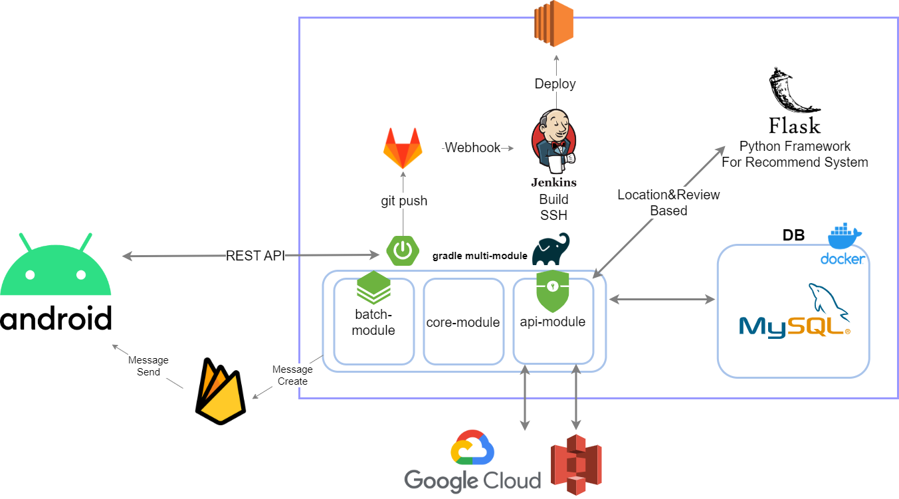
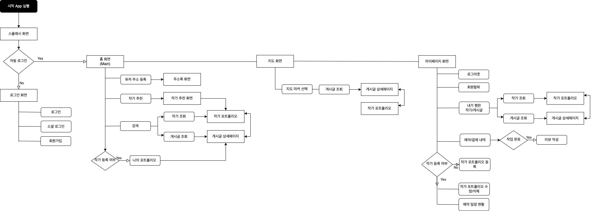
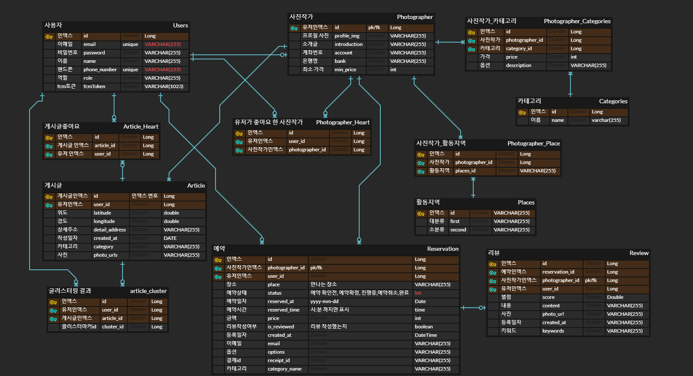

# ​🧡📷스마일(​SMILE)📷🧡


- SSAFY 8th PJT **Team D102**​ 🌞
- 프로젝트 기간 : `2023.01.03` ~ `2023.02.17`
- 구성원 : 이지윤, 이민하, 김정은, 신민철, 서재건  
- 팀 노션 : <a href="https://www.notion.so/ijiy00nlee/SMILE-0731e2debadf45dbbb087fc82feb4c20">👉 스마일(SMILE) Notion 👈</a>

<br>

# :green_book:​Contents

[:one:​ Specification](#one-specification)<br>
[:two:​ System Architecture](#system-architecture)<br>
[:three:​ Flow Chart](#three-flow-chart)<br>
[:four:​ ERD](#four-erd)<br>
[:five:​ WIKI](#five-wiki)<br>
[:six:​ Contributor](#six-contributor)<br>


<br>

## ​:one:​ Specification
```
👉 Android
```
<table class="tg">
<tbody>
  <tr>
    <td><b>Architecture</b></td>
    <td>Clean Architecture, MVVM</td>
  </tr>
<tr>
    <td><b>Design Pattern</b></td>
<td>SSA(Single-Activity-Architecture), Singleton</td>
</tr>
<tr>
    <td><b>Jetpack Components</b></td>
<td>Navigation Component, ViewBinding, LiveData, ViewModel, Lifecycle, Room/SQLite</td>
</tr>
<tr>
    <td><b>Network</b></td>
<td>Retrofit2, OkHttp</td>
</tr>
<tr>
    <td><b>Third Party Library</b></td>
    <td>Coroutine, Glide, Image Cropper, TedPermission, Lottie, Spin-kit, Naver map API, Kakao API, BootPay API Firebase(FCM & Hosting)</td>
</tr>
<tr>
    <td><b>Other Tool</b></td>
<td>Jira, Git, Notion, Slack, Figma, Zeplin</td>
</tr>
<tr>
    <td><b>Strategy</b></td>
<td>Jira & Git Flow</td>
</tr>
</tbody>
</table>

<br>

```
👉 Server
```
<table class="tg">
<tbody>
  <tr>
    <td><b>Architecture</b></td>
    <td>MVC</td>
  </tr>
<tr>
    <td><b>Design Pattern</b></td>
<td>Builder Pattern/Singleton Pattern</td>
</tr>
<tr>
    <td><b>DB</b></td>
<td>MySQL 8.0.23</td>
</tr>
<tr>
    <td><b>Dependency Injection</b></td>
<td>Gradle 7.6</td>
</tr>
<tr>
    <td><b>Strategy</b></td>
<td>Git Flow</td>
</tr>

<tr>
    <td><b>Third Party Library</b></td>
    <td> OAuth2, Kakao API, Google Cloud API, coolsms, </td>

</tr>
<tr>
    <td><b>Other Tool</b></td>
<td>Notion, Slack</td>
</tr>
</tbody>
</table>

<br>

<br>


## :two:​ System Architecture




<br>

## :three:​ Flow Chart




<br>

## :four:​ ERD




<br>


## :five:​ WIKI
```
👉 Team Rules(Git, Coding Convention) 및 구현 
```
- [HOME](https://github.com/SMILE-SSAFY/.github/wiki)
  - [1. Team Rules](https://github.com/SMILE-SSAFY/.github/wiki/1.-Team-Rules)
  - [2. Android Coding Convention](https://github.com/SMILE-SSAFY/.github/wiki/2.-Android-Coding-Convention)
  - [3. Server Coding Convention](https://github.com/SMILE-SSAFY/.github/wiki/3.-Server-Coding-Convention)
  - [4. Android 구현 내용](https://github.com/SMILE-SSAFY/.github/wiki/4.-Android-Content)
  - [5. Server 구현 내용](https://github.com/SMILE-SSAFY/.github/wiki/5.-Server-Content)


<br>


## :six:​ Contributor

```
👉 팀원 소개와 역할 분담
```

<table class="tg">
<tbody>
    <tr>
        <td>이지윤</td>
        <td>이민하</td>
    </tr>
    <tr>
        <td><a href="https://github.com/jiy00nLee">@jiy00nLee</a></td>
        <td><a href="https://github.com/minha721">@minha721</a></td>
    </tr>
    <tr>
        <td></td>
        <td></td>
    </tr>
    <tr>
        <td><a href="https://github.com/SMILE-SSAFY/.github/wiki/4.-Android-Content">Android Dev</a></td>
        <td><a href="https://github.com/SMILE-SSAFY/.github/wiki/4.-Android-Content">Android Dev</a></td>
    </tr>
    <tr>
        <td><a href="https://github.com/SMILE-SSAFY/.github/wiki/4.4.0-구조%20설계">구조 설계</a><br>
        <a href="https://github.com/SMILE-SSAFY/.github/wiki/4.4.4-주소록">주소록</a><br>
        <a href="https://github.com/SMILE-SSAFY/.github/wiki/4.4.5-작가%20포트폴리오">작가 포트폴리오 등록/수정</a><br>
        <a href="https://github.com/SMILE-SSAFY/.github/wiki/4.4.6-게시글%20및%20지도">주변 게시글 목록(지도)</a><br>
        <a href="https://github.com/SMILE-SSAFY/.github/wiki/4.4.6-게시글%20및%20지도">게시글 등록/수정</a><br>
        <a href="https://github.com/SMILE-SSAFY/.github/wiki/4.4.9-나의%20관심%20내역">나의 관심 내역</a><br>
        <a href="https://github.com/SMILE-SSAFY/.github/wiki/4.4.11-작가%20리뷰">작가 리뷰 등록/수정/조회</a><br>
        <a href="https://github.com/SMILE-SSAFY/.github/wiki/4.4.12-이미지%20유틸">이미지 유틸(ImageUtils)</a><br>
        <a href="https://github.com/SMILE-SSAFY/.github/wiki/4.4.13-권한%20처리">권한 처리(PermissionUtils)</a><br></td>
      <td>스플래시<br>
        회원가입<br>
        로그인<br>
        주변 작가 목록<br>
        작가 포트폴리오 조회<br>
        게시글 조회<br>
        검색(작가, 게시글)<br>
        예약 및 결제<br>
        작가 추천</td>
        커스텀 뷰</td>
    </tr>
</tbody>
</table>
<table class="tg">
<tbody>
    <tr>
        <td>김정은</td>
        <td>신민철</td>
        <td>서재건</td>
    </tr>
    <tr>
        <td><a href="https://github.com/kjjee99">@kjjee99</a></td>
        <td><a href="https://github.com/ringcho">@ringcho</a></td>
        <td><a href="https://github.com/RUNGOAT">@RUNGOAT</a></td>
    </tr>
    <tr>
        <td></td>
        <td></td>
        <td></td>
    </tr>
    <tr>
        <td><a href="https://github.com/SMILE-SSAFY/.github/wiki/5.-Server-Content">Server Dev</a></td>
        <td><a href="https://github.com/SMILE-SSAFY/.github/wiki/5.-Server-Content">Server Dev</a></td>
        <td><a href="https://github.com/SMILE-SSAFY/.github/wiki/5.-Server-Content">Server Dev</a></td>
    </tr>
    <tr>
        <td>작가관리<br>
        예약, 예약 알림<br>
        결제<br>
        마이페이지<br>
        서버 배포 환경 구축</td>
        <td>포트폴리오/게시글 조회<br>
        게시글, 리뷰 등록<br>
        주변 게시글 목록<br>
        마이페이지<br>
        작가 추천</td>
        <td>회원관리<br>
        주변 작가 목록<br>
        작가/게시글 검색<br>
        마이페이지<br>
        스프링 배치</td>
    </tr>
</tbody>
</table>


